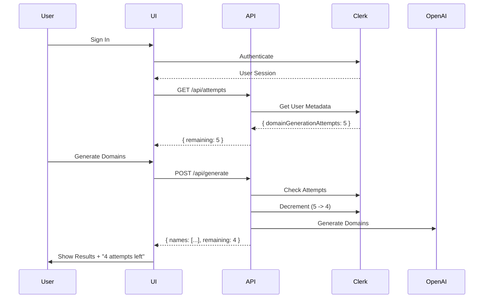

# Clerk Authentication Integration

## Overview

Clerk authentication has been successfully integrated into the Find My Domain web application to provide user authentication and rate limiting **without requiring a database**.

## Features Implemented

### 1. **User Authentication**
- ✅ Sign in/Sign up with Clerk (email, Google, GitHub, etc.)
- ✅ User profile management via Clerk's UserButton
- ✅ Protected routes (demo, API endpoints)

### 2. **Rate Limiting (No Database Required)**
- ✅ 5 free domain generations per user
- ✅ Attempt tracking stored in Clerk's `publicMetadata`
- ✅ Real-time attempts counter on demo page
- ✅ Progress bar showing remaining attempts
- ✅ Automatic decrementation on each generation

### 3. **Security**
- ✅ Protected API routes require authentication
- ✅ Middleware protection for sensitive endpoints
- ✅ Server-side attempt validation
- ✅ Client-side UI disabling when unauthorized

## Implementation Details

### File Changes

#### New Files
1. **`apps/web/middleware.ts`**
   - Clerk middleware configuration
   - Protected route matching

2. **`apps/web/app/api/attempts/route.ts`**
   - GET: Fetch remaining attempts
   - POST: Decrement attempts
   - DELETE: Reset attempts (admin/testing)

#### Modified Files
1. **`apps/web/app/layout.tsx`**
   - Added `ClerkProvider` wrapper

2. **`apps/web/app/demo/page.tsx`**
   - Added `useUser` hook for auth state
   - Sign in/sign out buttons
   - Remaining attempts counter with progress bar
   - Auth-required alerts
   - Disabled form when not authenticated

3. **`apps/web/components/demo/domain-generator-form.tsx`**
   - Added `disabled` prop
   - Form disables when user is not authenticated

4. **`apps/web/app/api/generate/route.ts`**
   - Added Clerk auth check
   - Attempt validation before generation
   - Automatic attempt decrementation
   - Returns remaining attempts in response

## Environment Variables

### Required Keys

```env
# Clerk Authentication
NEXT_PUBLIC_CLERK_PUBLISHABLE_KEY=pk_test_your-key-here
CLERK_SECRET_KEY=sk_test_your-key-here

# OpenAI API (existing)
OPENAI_API_KEY=sk-your-openai-key-here
```

### Getting Clerk Keys

1. Go to [https://clerk.com](https://clerk.com)
2. Create account and application
3. Navigate to **API Keys** in dashboard
4. Copy both keys to `.env.local`

## How It Works

### Attempt Tracking Flow



### Data Storage

- **No database required!**
- Uses Clerk's `publicMetadata` field
- Automatically synchronized across devices
- Persistent across sessions

```typescript
// User metadata structure
interface AttemptsMetadata {
  domainGenerationAttempts?: number;
}

// Default: 5 attempts
// Decrements: 5 -> 4 -> 3 -> 2 -> 1 -> 0
// At 0: Generation blocked
```

## Protected Routes

The following routes require authentication:

- `/demo` - Interactive demo page
- `/api/generate` - Domain generation endpoint
- `/api/check-domain` - Domain availability endpoint
- `/api/attempts` - Attempts management endpoint

## User Experience

### Before Sign In
1. User visits `/demo`
2. Sees "Sign In Required" alert
3. Clicks "Sign In" button
4. Clerk modal opens
5. User authenticates

### After Sign In
1. User sees "Remaining Attempts: 5/5" with progress bar
2. Form is enabled
3. User generates domains
4. Counter updates: "Remaining Attempts: 4/5"
5. Toast notification: "Generated X domain names!"

### When Out of Attempts
1. Counter shows "0/5"
2. Form is disabled
3. Message: "No attempts left. Contact support."

## Testing

### Local Development

```bash
cd apps/web

# Create .env.local with your Clerk keys
echo "NEXT_PUBLIC_CLERK_PUBLISHABLE_KEY=pk_test_..." >> .env.local
echo "CLERK_SECRET_KEY=sk_test_..." >> .env.local

# Start dev server
pnpm dev

# Visit http://localhost:3000/demo
# Sign in and test!
```

### Resetting Attempts (Development)

```bash
# Use DELETE endpoint to reset to 5
curl -X DELETE http://localhost:3000/api/attempts \
  -H "Cookie: __session=your-session-cookie"
```

## Production Deployment

### Environment Variables

Set these in your deployment platform (Vercel, Netlify, etc.):

```env
NEXT_PUBLIC_CLERK_PUBLISHABLE_KEY=pk_live_...  # Production key
CLERK_SECRET_KEY=sk_live_...                    # Production key
OPENAI_API_KEY=sk-...                           # Your OpenAI key
```

### Clerk Dashboard Configuration

1. **Allowed Domains**: Add your production domain
2. **Sign-in Methods**: Enable desired providers (Email, Google, GitHub)
3. **Session Settings**: Configure session duration
4. **Webhooks** (Optional): Add webhooks for advanced features

## Cost Analysis

### Clerk Pricing
- **Free Tier**: 10,000 monthly active users
- **Pro**: $25/month for more features
- **Enterprise**: Custom pricing

### With 5 Attempts/User
- Free tier supports: 10,000 users × 5 = **50,000 generations/month**
- Cost per generation: **$0** (within free tier)

## Troubleshooting

### Build Fails with "Missing publishableKey"

**Solution**: Ensure `.env.local` exists with valid keys, or build will use conditional logic to skip Clerk.

### "Unauthorized" Error

**Solution**: User needs to sign in. Check that Clerk keys are set correctly.

### Attempts Not Updating

**Solution**: 
1. Check browser console for errors
2. Verify API route is being called
3. Check Clerk dashboard for user metadata

### Can't Sign In

**Solution**:
1. Verify `NEXT_PUBLIC_CLERK_PUBLISHABLE_KEY` is set
2. Check browser console for Clerk errors
3. Ensure allowed domains are configured in Clerk dashboard

## Future Enhancements

Possible improvements:

1. **Admin Dashboard**: Reset user attempts
2. **Payment Integration**: Offer paid plans for more attempts
3. **Analytics**: Track usage patterns
4. **Webhooks**: Listen to Clerk events
5. **Teams**: Share attempts across team members
6. **Credits System**: More granular control than simple counter

## Summary

✅ **Zero Database Required** - All data in Clerk metadata  
✅ **Secure** - Server-side validation + client-side UX  
✅ **Scalable** - Handles 10,000 users on free tier  
✅ **Professional** - Real auth with social logins  
✅ **User Friendly** - Clear UI with progress tracking  

---

**Author**: Dmitrii Selikhov  
**Date**: 2025-11-18  
**Version**: 1.4.1

